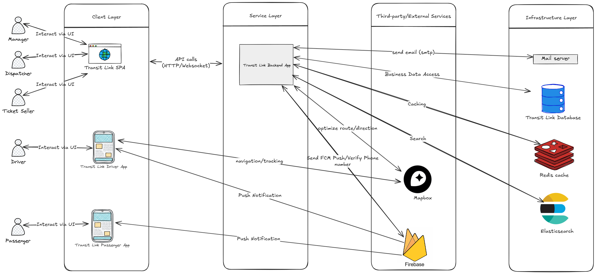
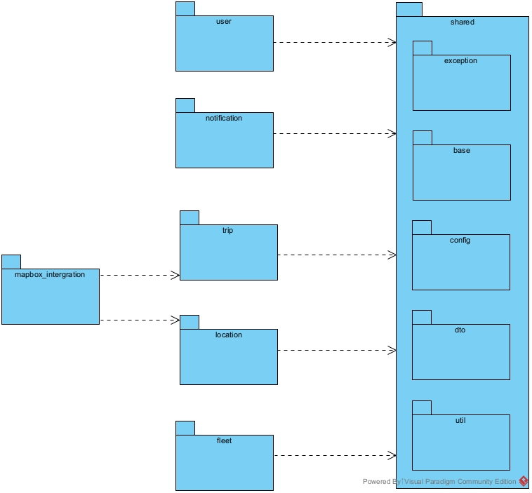
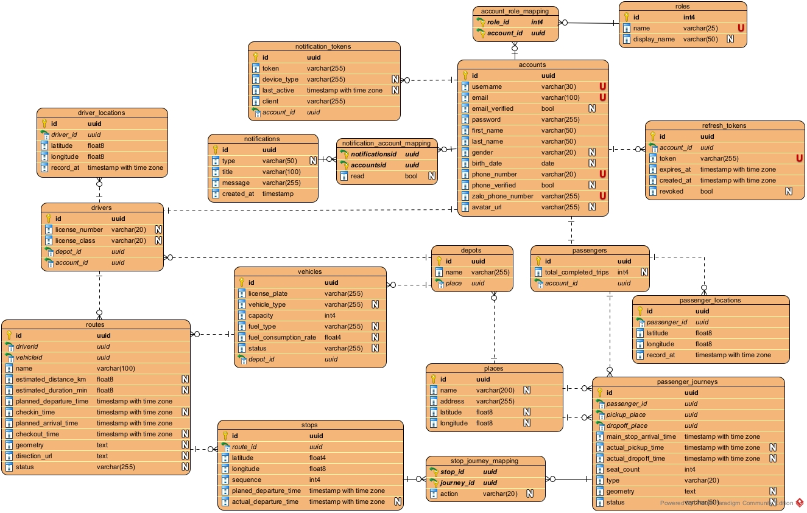
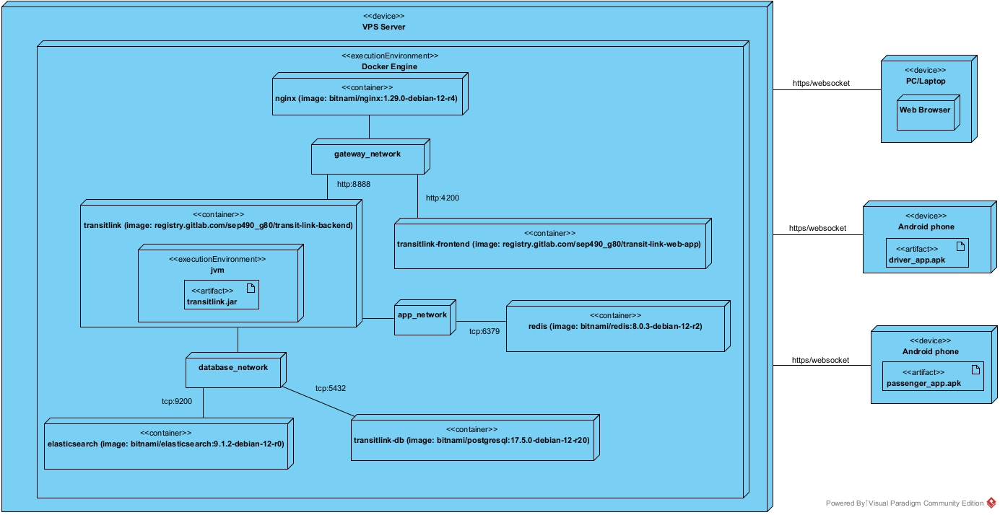

## Transit Link Backend
Transit Link Backend is the **backend service** for an **automated shuttle dispatching system**, 
implemented as a **Spring Modulith** using **Spring Boot 3.4.x** and **Java 21**,  
with modern DevOps deployment practices (**Docker**, **GitLab CI/CD**).
---
## Overview
This system provides:
- **Automatic route optimization** for shuttle drivers
- **Multi-operator fleet management & dispatching**
- **Real-time monitoring** (vehicle tracking, trip status)
- **Authentication & Authorization** with Spring Security (OAuth2 + JWT)
- **Notifications** (Websocket, Firebase push)
- **File storage** with compression and resizing (extensible to cloud storage)
---
## Demo
- [Demo API](https://api.transitlink.dpdns.org/auth-dashboard.html)
- Test Account: `manager@example.com / manager123`
---

## System Architecture

The system follows a **layered architecture** with a **modular monolith backend**, external services, and multiple clients.

  

### Layers

- **Client Layer**
    - Web SPA (Transit Link SPA) for managers, dispatchers, ticket sellers
    - Mobile Apps (Driver App, Passenger App) for navigation, ticketing, and notifications

- **Service Layer**
    - Single backend application (**Transit Link Backend App**)
    - Exposes **REST APIs** over HTTPS
    - Provides **WebSocket endpoints** for real-time communication (tracking, notifications)
    - Handles business logic, navigation/tracking, notifications, and integrations

- **Third-party / External Services**
    - **Mapbox** → route optimization, navigation, maps
    - **Firebase** → push notifications (FCM), phone number verification
    - **Mail Server (SMTP)** → transactional emails

- **Infrastructure Layer**
    - **PostgreSQL** → primary relational database
    - **Redis** → caching
    - **Elasticsearch** → search

### Key Features
- Real-time tracking via **WebSocket + Mapbox**
- Push notifications to drivers & passengers via **Firebase**
- Optimized trip planning using **route calculation services**
---
## Modular Design (Package Diagram)

The backend is implemented as a **Spring Modulith**, separating business logic into independent modules.

  

### Core Modules

- **user** → Manage user information, roles, and profile
- **trip** → Trip management (scheduling, routing, assignment of drivers/vehicles)
- **location** → Handle real-time geolocation, navigation, and tracking
- **fleet** → Manage vehicles, drivers, and fleet resources
- **notification** → Email and push notifications (via Firebase)

### Integration Modules
- **mapbox_integration**
    - route optimization
    - search places

### Shared Module

- **shared** → Cross-cutting concerns and utilities
    - `exception` → Centralized exception handling
    - `base` → Common base classes for entities/services
    - `config` → Global configurations
    - `dto` → Shared DTOs across modules
    - `util` → Utility functions
---
### Benefits of Modular Design
- **High cohesion** → Each module focuses on a single bounded context
- **Low coupling** → Shared concerns are centralized in `shared`, external integrations isolated in `*_integration` modules
- **Scalability** → New modules (e.g., payments, reporting) can be added without breaking existing ones
---
## Database Design (ERD)

The system database is designed in **PostgreSQL** with normalized relational schemas.

  

### Main Entities

- **accounts / roles / account_role_mapping**
    - User management with role-based access control (RBAC).
    - Includes login credentials, profile info, and avatar.

- **refresh_tokens**
    - Secure JWT refresh token storage with expiration.

- **drivers / driver_locations**
    - Driver profile, license details, and depot assignment.
    - Real-time tracking of driver position (`latitude`, `longitude`).

- **vehicles**
    - Fleet details including license plate, type, capacity, fuel type, and depot.

- **routes / stops / stop_journey_mapping**
    - Shuttle routes with planned distances, durations, and stop sequencing.
    - Mapping stops to journeys with defined actions.

- **passengers / passenger_journeys / passenger_locations**
    - Passenger trips, pickup & drop-off places.
    - Tracks trip history and passenger’s last known location.

- **places / depots**
    - Central depots and named locations with geospatial attributes.

- **notifications / notification_tokens / notification_account_mapping**
    - Push notification system with multi-device token support per account.

---
## Deployment Diagram

The system is deployed on a **VPS Server** using **Docker Engine** with multiple containers.  
Infrastructure setup (Docker Compose, Ansible, environment configs) is maintained in a separate repository:  
[TransitLink Infrastructure Repository](https://github.com/nvlinhdev/transitlink_infrastructure)

  

### Runtime Components

- **Nginx (Reverse Proxy)**
    - Routes traffic to backend (`:8888`) and frontend (`:4200`).
    - Handles HTTPS termination.

- **TransitLink Backend**
    - Image: `registry.gitlab.com/sep490_g80/transit-link-backend`
    - Runs on JVM as a Spring Boot executable (`transitlink.jar`).
    - Connected to PostgreSQL, Redis, and Elasticsearch.

- **TransitLink Frontend**
    - Image: `registry.gitlab.com/sep490_g80/transit-link-web-app`
    - Angular application served via Nginx.

- **PostgreSQL Database**
    - Image: `bitnami/postgresql:17.5.0-debian-12-r20`
    - Stores relational data (accounts, routes, passengers, vehicles, etc.).

- **Redis**
    - Image: `bitnami/redis:8.0.3-debian-12-r2`
    - Used for caching.

- **Elasticsearch**
    - Image: `bitnami/elasticsearch:9.1.2-debian-12-r0`
    - Provides search capabilities.

---

### Networks

- **gateway_network**
    - Connects Nginx with backend and frontend.

- **app_network**
    - Connects backend with Redis.

- **database_network**
    - Connects backend with PostgreSQL and Elasticsearch.

---

### Clients

- **Web Browser (PC/Laptop)**
    - Access frontend via Nginx.

- **Driver App (Android)**
    - APK installed on driver’s phone.
    - Communicates with backend via WebSocket/HTTP.

- **Passenger App (Android)**
    - APK installed on passenger’s phone.
    - Communicates with backend via WebSocket/HTTP.

## Tech Stack
- **Java 21**, **Spring Boot 3.4.x**
- **Gradle**
- **PostgreSQL**
- **Redis**
- **Elasticsearch**
- **Websocket + SockJS + STOMP**
- **Docker**, **Docker Compose**
- **GitLab CI/CD**
